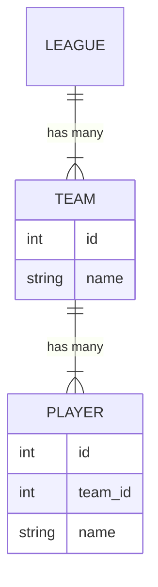
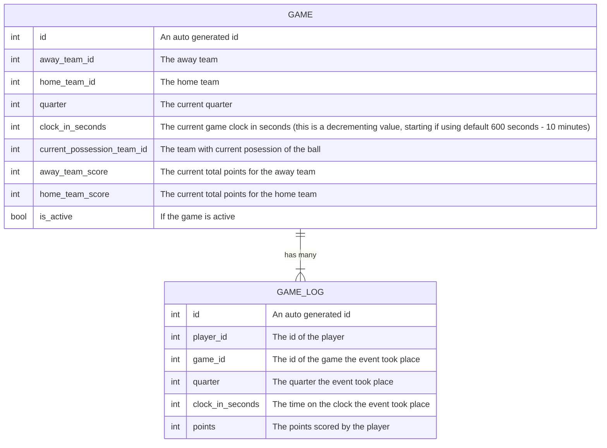

# Overview

This repo contains the codebase for a basketball season simulator. This code writes its results and season state to a MySQL database, and the idea is to generate events for practice use in Kafka, Kafka Connect, and ksql.

This sim is not a perfect represenation of a basketball season, and it's not intended to be. It's main goal is to try and generate streaming data for analysis practice.

# Technologies used at a glance

- Docker
- Python
- Apache Kafka
- Apache Zookeeper
- Confluent ksql
- Apache Schema Registry
- Apache Kafka Connect
- MySQL

> Note: If you're running Docker on Apple Silicon, note that there are not native images for ksqldb, ksqldb-cli, and Kafka-Connect. Docker will try to use emulation, which is slow. I personally found those containers would occasionally freeze and I had to restart them to get them working. 

> Note: This is a pretty heavy docker compose stack. I recommend making sure to limit the resources that are available to Docker, i.e number of cores, etc. Otherwise running this stack my cause your system to hang.

We'll flip between a few terminals that we need to leave open to check on things as the sim is running; I recommend having a terminal system that allows for tabs to make this easier.

# Sim overview

The constants in this simulator are configurable. The default is a league is 30 teams with 15 players. A season is 72 games total. There are 4 quarters in a game, 10 minutes each. Each posession by a team is 30 seconds. The sim assumes all 15 players on a team are eligible for play in a game (in the real world you may have players that in-eligble for play due to injury; suspension and fines from the league due to promoting gun violence, etc). 

Players do not switch teams during the sim (i.e. teams that trade players during the season). It assumes that every posession of the ball by a team in a game lasts the full 30 seconds.

The simulator operates at random intervals (also configurable; default is between 10 and 30 seconds) and is known as a "tick". The interval is to allow some predictability when watching streaming data come through into Kafka.

For every tick, the sim will simulate 4 active games (also configurable) at a time. For each active game, it will simulate a ball possession by a team. 

At the start of each simulated team possession, the sim will:

- Get the current game state (the current quarter, how many minutes are left in the quarter, the current score for the game).
- For the team with the active posession of the ball, randomly determime if that team should score on that posession.
    - If yes, it will randomly choose one of the players for the team that has current posession of the ball to "score" 1, 2, or 3 points. It will record in the `game_log` table the scorer (`player_id`), the `game_id`, the `quarter` and the clock and the `points` scored.
    - If no, the posession will end.
- Once the posession has ended, it will update the game state: update the total score for each team, subtract the posession time (30 seconds) from the game clock for the current quarter, and if needed, advance the game to the next quarter. 
- If the game clock has ended (i.e the 4th quarter has finished with 10 simulated minutes elapsed) the game is over, and upon the next tick the game will create a new game to simulate and save that game state.
    - To create a new game, the sim will randomly try to search for two teams who are not actively playing each other and are not actively playing. It will loop until it can find a set of teams to meet these conditions.

The sim ends its run once all 72 games have been simulated. Note that the sim never exists, it just prints out "Season has ended..." if there are no more games to simulate.

The team and player names are auto generated using the `names` and `randomname` libraries from Python.

# Data model

## League setup



## Sim setup




# Tech overview and walk-thru

Navigate to the `docker-compose` folder in a terminal and run `docker-compose up` to bring online the stack. Note that you will likely need to watch the stack and restart any containers that have failed to come online. You may need to wait a few minutes for the entire stack to finish coming online: the kafka-connect containers for example after coming online will try to live install the MySQL Debezium connectors, which takes some time. Try to watch your docker output to verify that the `kafka-connect-1` container has finished adding the Debezium MySQL plugin.

Because of how heavy this docker stack is, it may take a little while for the stack to stablize and/or a need to restart any containers that have hung. On my machine (M2 Macbook w/ 6 cores dedicated to Docker) this was about 3 - 5 minutes of sheparding/waiting.

## Setup MySQL structures

The simulator expects to persist it's entire state to a MySQL database. It will create on inital startup the needed data structures and also generate the inital data set (teams and players). 

> Note: if needed, run `pip install -r requirements.txt` to get the needed Python packages first.

First, run `python3 init.py` which will setup the MySQL database with the needed tables and populate random team and player names.

If you want to validate, open a new terminal and shell into the MySQL docker container:

- Run `docker ps` to ensure that the container "db" is running
- Run `docker exec -it db bash` to get into the container with a terminal
- Run `mysql --user=root --password=bball` to get a MySQL terminal
- Run `show databases;` to get a list of databases:

```
mysql> show databases;
+--------------------+
| Database           |
+--------------------+
| bball              |
| information_schema |
| performance_schema |
+--------------------+
3 rows in set (0.01 sec)
```

- Run `use bball;` to set your current database to the basketball database:

```
mysql> use bball;
Reading table information for completion of table and column names
You can turn off this feature to get a quicker startup with -A

Database changed
```

Validate that the tables were created by running `show tables;`

```
mysql> show tables;
+-----------------+
| Tables_in_bball |
+-----------------+
| GAME            |
| GAME_LOG        |
| PLAYER          |
| TEAM            |
+-----------------+
4 rows in set (0.00 sec)
```

Validate that the teams were created (Note: the names are auto generated and will differ from what you see here) by running `select * from TEAM;`

```
mysql> select * from TEAM;
+----+--------------------+
| id | name               |
+----+--------------------+
|  1 | Chill Wolverine    |
|  2 | Inverted Owl       |
|  3 | Horizontal Ocelot  |
|  4 | Frigid Mamba       |
|  5 | Greasy Python      |
|  6 | Principal Mandrill |
|  7 | Mild Ocelot        |
|  8 | Oriented Marlin    |
|  9 | Little Eagle       |
| 10 | Milky Coyote       |
| 11 | Zingy Ray          |
| 12 | Constant Serval    |
| 13 | Celeste Cobra      |
| 14 | Instant Shark      |
| 15 | Warm Wolverine     |
| 16 | Lazy Serval        |
| 17 | Dynamic Human      |
| 18 | External Eel       |
| 19 | Legato Leopard     |
| 20 | Simple Serval      |
| 21 | Rigid Owl          |
| 22 | Concrete Lion      |
| 23 | Creative Mandrill  |
| 24 | Coped Crocodile    |
| 25 | Juvenile Marlin    |
| 26 | Silver Wolf        |
| 27 | Isothermal Civet   |
| 28 | Corporate Owl      |
| 29 | Ordered Crocodile  |
| 30 | District Leopard   |
+----+--------------------+
30 rows in set (0.00 sec)
```

Because we'll use this user for change data capture in Kafka Connect, let's make sure to grant all permissions to this user (obviously this is insecure, but since this is a lab we'll proceed). Run the following:

```
GRANT ALL PRIVILEGES ON *.* TO 'bball'@'%';
FLUSH PRIVILEGES;
```

Leave this terminal open as we'll refer to it as the simulation runs.


## Configure Kafka-UI for work

Kafka-UI is an open source web application that is useful for interacting with a Kafka Cluster and it's related projects.

Navigate to [http://localhost:8080](http://localhost:8080) which should give you the UI.

Click "Configure new cluster" and enter the following values for each section:

| Section           | Item      | Value                                       |
| ----------------- | --------- | ------------------------------------------- |
| Cluster Name      |           | bball                                       |
| Bootstrap Servers | Host/Port | kafka-1:9092                                |
| ksqldb            | url       | http://ksqldb-server-1:8088                 |
| kafka-connect     | name/url  | kafka-connect-1/http://kafka-connect-1:8083 |
| Schema Registry   | url       | http://schema-registry:8081                 |


You can click "Validate" to ensure that your settings are correct, and if everything looks Okay, you can click "Submit" to established settings for your cluster. Alternatively, you can click "Validate" in between adding each setting to validate that everything is working properly.

> Note: I recommend clicking "Validate" in between adding each setting if you're running on Apple Silicon as there aren't native images for ksqldb, ksqldb-cli, and Kafka Connect. This means emulation will happen, which means the containers will be slow. If you click "Validate" and you get a response that a connection was refused, for example, it usually means that the respective container has hung and you'll need to restart that container until it starts responding. In my experience it was usually either the `ksqldb-server-1` or one of the `kafka-connect-1` containers.

> Note: You don't need two kafka-connect containers; however because of the lag/freezing on Apple Silicon I would occasionally switch connections between them. I have the second commented out by default in the `docker-compose` file, but depending on your situation you may bring the other online.

Once your cluster is configured and you've validated that your settings are correct and you can talk to your containers, click "Submit" and navigate to your cluster. We'll go to "Kafka Connect" and we'll create some connectors to pull data from MySQL into Kafka using Debezium.

Click on "Kafka Connect" and on the upper right click "Create Connector."

For the name give it `mysql-bball` (note that this setting needs to match the `name` parameter below) and for the config you can copy paste the below:

```
{
	"connector.class": "io.debezium.connector.mysql.MySqlConnector",
	"database.user": "bball",
	"topic.prefix": "dbz",
	"schema.history.internal.kafka.topic": "schema-changes.bball",
	"database.server.id": "1",
	"tasks.max": "1",
	"database.hostname": "db",
	"database.password": "bball",
    "database.allowPublicKeyRetrieval":"true",
    "database.history.kafka.bootstrap.servers": "kafka-1:9092",
    "database.history.kafka.topic": "bball-history",
    "database.server.name" : "bball",
	"name": "mysql-bball",
	"schema.history.internal.kafka.bootstrap.servers": "kafka-1:9092",
	"database.port": "3306",
	"database.include.list": "bball"
}
```

Alternatively, if you want to do this from a terminal:

```
 curl -X PUT http://localhost:8083/connectors/mysql-bball/config -H "Content-Type: application/json" -d '{
	"connector.class": "io.debezium.connector.mysql.MySqlConnector",
	"database.user": "bball",
	"topic.prefix": "dbz",
	"schema.history.internal.kafka.topic": "schema-changes.bball",
	"database.server.id": "1",
	"tasks.max": "1",
	"database.hostname": "db",
	"database.password": "bball",
    "database.allowPublicKeyRetrieval":"true",
    "database.history.kafka.bootstrap.servers": "kafka-1:9092",
    "database.history.kafka.topic": "bball-history",
    "database.server.name" : "bball",
	"name": "mysql-bball",
	"schema.history.internal.kafka.bootstrap.servers": "kafka-1:9092",
	"database.port": "3306",
	"database.include.list": "bball"
}';
```

If you get errors you can also PUT to the following to validate. This will give you a JSON response with any errors that you might have:

```
 curl -X PUT http://localhost:8083/connector-plugins/io.debezium.connector.mysql.MySqlConnector/config/validate -H "Content-Type: application/json" -d '{
	"connector.class": "io.debezium.connector.mysql.MySqlConnector",
	"database.user": "bball",
	"topic.prefix": "dbz",
	"schema.history.internal.kafka.topic": "schema-changes.bball",
	"database.server.id": "1",
	"tasks.max": "1",
	"database.hostname": "db",
	"database.password": "bball",
    "database.allowPublicKeyRetrieval":"true",
    "database.history.kafka.bootstrap.servers": "kafka-1:9092",
    "database.history.kafka.topic": "bball-history",
    "database.server.name" : "bball",
	"name": "mysql-bball",
	"schema.history.internal.kafka.bootstrap.servers": "kafka-1:9092",
	"database.port": "3306",
	"database.include.list": "bball"
}';
```

You can take the output and put it into a JSON Pretty Printer to make it easier to parse. Look for any fields where "errors: []" is not empty. The start of the response should give you an error count you can use to help narrow down what fields are missing or incorrect.

If you reload the "Kafka Connect" page in Kafka UI you should see the status of your connector, and more importantly, new topics that the connector is polling that are for the tables created earlier (created by our running  `python3 init.py`). 

We should have topics for "PLAYER" and "TEAM" since there are records there.


## Run the simulation

We'll now run `python3 sim.py` which will simulate the season in a different terminal.

Note that the code doesn't actually end... when the season is over it will loop and print "Season has ended..."

As the simulation is running, you can inspect topics in Kafka UI to make sure messages are being produced. Let's validate both of these things in MySQL and in ksql.

You'll get outputs in this terminal similar to the following:

```
Got active game: 8
Sim game_id: 8
Quarter: 2
Clock: 30
Away Team: 2
Home Team: 11
Who has the ball: 11
Sim says team should core on this posession: True
Away Team Score: 24
Home Team Score: 17
Total Players: 15
Random Player Index: 11
Player to score: 161
Points: 1
Home Team Scored 1 points!
Game Id: 8 clock is now: 0
Game Id: Posession now by team: 2
Game State:
[(8, 2, 11, 2, 0, 2, 24, 18, 1)]
Game sim finished...
```

Leave this terminal open so that the sim can run and simulate our basketball season.

### In MySQL

If you still have your MySQL shell into docker, run the following:

```
mysql> select * from GAME;
+----+--------------+--------------+---------+------------------+----------------------------+-----------------+-----------------+-----------+
| id | away_team_id | home_team_id | quarter | clock_in_seconds | current_possession_team_id | away_team_score | home_team_score | is_active |
+----+--------------+--------------+---------+------------------+----------------------------+-----------------+-----------------+-----------+
|  1 |           19 |           22 |       1 |              420 |                         19 |               0 |               5 |         1 |
|  2 |           21 |           30 |       1 |              420 |                         21 |               5 |               5 |         1 |
|  3 |           20 |            2 |       1 |              420 |                         20 |               2 |               6 |         1 |
|  4 |            1 |           25 |       1 |              420 |                          1 |               3 |               6 |         1 |
+----+--------------+--------------+---------+------------------+----------------------------+-----------------+-----------------+-----------+
4 rows in set (0.00 sec)

mysql> 
```

Note that your output may differ slightly as the sim generates random team values and scores.

### In ksql

In a different terminal, run `docker exec -it ksqldb-cli-1 bash` to get into our ksqldb-cli container.

Next, run the following:

```
[appuser@7e49776bffed ~]$ ksql http://ksqldb-server-1:8088
```

Which should get you into ksql's terminal:

```
OpenJDK 64-Bit Server VM warning: Option UseConcMarkSweepGC was deprecated in version 9.0 and will likely be removed in a future release.
                  
                  ===========================================
                  =       _              _ ____  ____       =
                  =      | | _____  __ _| |  _ \| __ )      =
                  =      | |/ / __|/ _` | | | | |  _ \      =
                  =      |   <\__ \ (_| | | |_| | |_) |     =
                  =      |_|\_\___/\__, |_|____/|____/      =
                  =                   |_|                   =
                  =        The Database purpose-built       =
                  =        for stream processing apps       =
                  ===========================================

Copyright 2017-2022 Confluent Inc.

CLI v0.28.2, Server v0.28.2 located at http://ksqldb-server-1:8088
Server Status: RUNNING

Having trouble? Type 'help' (case-insensitive) for a rundown of how things work!

ksql> 
```

#### Looking at topics

The first thing we'd like to do while we're in ksql is to have it always return topics from earliest messages rather than latest. Run the following to configure this:

```
SET 'auto.offset.reset' = 'earliest';
```

So our output is:

```
ksql> SET 'auto.offset.reset' = 'earliest';
Successfully changed local property 'auto.offset.reset' to 'earliest'. Use the UNSET command to revert your change.
ksql> 
```

We can inspect the topics available:

```
ksql> SHOW TOPICS;

 Kafka Topic                 | Partitions | Partition Replicas 
---------------------------------------------------------------
 _connect-configs            | 1          | 1                  
 _connect-offsets            | 25         | 1                  
 _connect-status             | 5          | 1                  
 bball                       | 1          | 1                  
 bball-history               | 1          | 1                  
 bball.bball.GAME            | 1          | 1                  
 bball.bball.GAME_LOG        | 1          | 1                  
 bball.bball.PLAYER          | 1          | 1                  
 bball.bball.TEAM            | 1          | 1                  
 default_ksql_processing_log | 1          | 1                  
---------------------------------------------------------------
ksql> 
```

We can inspect topics by printing them, and pressing Ctrl+C to cancel:

```
ksql> PRINT `bball.bball.GAME`;

Key format: HOPPING(KAFKA_INT) or TUMBLING(KAFKA_INT) or HOPPING(KAFKA_STRING) or TUMBLING(KAFKA_STRING) or KAFKA_STRING
Value format: AVRO
rowtime: 2023/08/13 15:07:00.382 Z, key: [1400140405@7166488599636816253/-], value: {"before": null, "after": {"id": 1, "away_team_id": 19, "home_team_id": 22, "quarter": 1, "clock_in_seconds": 600, "current_possession_team_id": 19, "away_team_score": 0, "home_team_score": 0, "is_active": 1}, "source": {"version": "1.7.0.Final", "connector": "mysql", "name": "bball", "ts_ms": 1691939219000, "snapshot": "false", "db": "bball", "sequence": null, "table": "GAME", "server_id": 1, "gtid": null, "file": "binlog.000002", "pos": 149482, "row": 0, "thread": null, "query": null}, "op": "c", "ts_ms": 1691939219879, "transaction": null}, partition: 0
rowtime: 2023/08/13 15:07:00.395 Z, key: [1400140405@7166488599636816509/-], value: {"before": null, "after": {"id": 2, "away_team_id": 21, "home_team_id": 30, "quarter": 1, "clock_in_seconds": 600, "current_possession_team_id": 21, "away_team_score": 0, "home_team_score": 0, "is_active": 1}, "source": {"version": "1.7.0.Final", "connector": "mysql", "name": "bball", "ts_ms": 1691939219000, "snapshot": "false", "db": "bball", "sequence": null, "table": "GAME", "server_id": 1, "gtid": null, "file": "binlog.000002", "pos": 149802, "row": 0, "thread": null, "query": null}, "op": "c", "ts_ms": 1691939219886, "transaction": null}, partition: 0
rowtime: 2023/08/13 15:07:00.396 Z, key: [1400140405@7166488599636816765/-], value: {"before": null, "after": {"id": 3, "away_team_id": 20, "home_team_id": 2, "quarter": 1, "clock_in_seconds": 600, "current_possession_team_id": 20, "away_team_score": 0, "home_team_score": 0, "is_active": 1}, "source": {"version": "1.7.0.Final", "connector": "mysql", "name": "bball", "ts_ms": 1691939219000, "snapshot": "false", "db": "bball", "sequence": null, "table": "GAME", "server_id": 1, "gtid": null, "file": "binlog.000002", "pos": 150122, "row": 0, "thread": null, "query": null}, "op": "c", "ts_ms": 1691939219888, "transaction": null}, partition: 0
rowtime: 2023/08/13 15:07:00.397 Z, key: [1400140405@7166488599636817021/-], value: {"before": null, "after": {"id": 4, "away_team_id": 1, "home_team_id": 25, "quarter": 1, "clock_in_seconds": 600, "current_possession_team_id": 1, "away_team_score": 0, "home_team_score": 0, "is_active": 1}, "source": {"version": "1.7.0.Final", "connector": "mysql", "name": "bball", "ts_ms": 1691939219000, "snapshot": "false", "db": "bball", "sequence": null, "table": "GAME", "server_id": 1, "gtid": null, "file": "binlog.000002", "pos": 150442, "row": 0, "thread": null, "query": null}, "op": "c", "ts_ms": 1691939219889, "transaction": null}, partition: 0
rowtime: 2023/08/13 15:07:00.398 Z, key: [1400140405@7166488599636816253/-], value: {"before": {"id": 1, "away_team_id": 19, "home_team_id": 22, "quarter": 1, "clock_in_seconds": 600, "current_possession_team_id": 19, "away_team_score": 0, "home_team_score": 0, "is_active": 1}, "after": {"id": 1, "away_team_id": 19, "home_team_id": 22, "quarter": 1, "clock_in_seconds": 570, "current_possession_team_id": 19, "away_team_score": 0, "home_team_score": 0, "is_active": 1}, "source": {"version": "1.7.0.Final", "connector": "mysql", "name": "bball", "ts_ms": 1691939219000, "snapshot": "false", "db": "bball", "sequence": null, "table": "GAME", "server_id": 1, "gtid": null, "file": "binlog.000002", "pos": 150771, "row": 0, "thread": null, "query": null}, "op": "u", "ts_ms": 1691939219898, "transaction": null}, partition: 0
rowtime: 2023/08/13 15:07:00.399 Z, key: [1400140405@7166488599636816253/-], value: {"before": {"id": 1, "away_team_id": 19, "home_team_id": 22, "quarter": 1, "clock_in_seconds": 570, "current_possession_team_id": 19, "away_team_score": 0, "home_team_score": 0, "is_active": 1}, "after": {"id": 1, "away_team_id": 19, "home_team_id": 22, "quarter": 1, "clock_in_seconds": 570, "current_possession_team_id": 22, "away_team_score": 0, "home_team_score": 0, "is_active": 1}, "source": {"version": "1.7.0.Final", "connector": "mysql", "name": "bball", "ts_ms": 1691939219000, "snapshot": "false", "db": "bball", "sequence": null, "table": "GAME", "server_id": 1, "gtid": null, "file": "binlog.000002", "pos": 151137, "row": 0, "thread": null, "query": null}, "op": "u", "ts_ms": 1691939219902, "transaction": null}, partition: 0
rowtime: 2023/08/13 15:07:00.399 Z, key: [1400140405@7166488599636816509/-], value: {"before": {"id": 2, "away_team_id": 21, "home_team_id": 30, "quarter": 1, "clock_in_seconds": 600, "current_possession_team_id": 21, "away_team_score": 0, "home_team_score": 0, "is_active": 1}, "after": {"id": 2, "away_team_id": 21, "home_team_id": 30, "quarter": 1, "clock_in_seconds": 600, "current_possession_team_id": 21, "away_team_score": 2, "home_team_score": 0, "is_active": 1}, "source": {"version": "1.7.0.Final", "connector": "mysql", "name": "bball", "ts_ms": 1691939219000, "snapshot": "false", "db": "bball", "sequence": null, "table": "GAME", "server_id": 1, "gtid": null, "file": "binlog.000002", "pos": 151503, "row": 0, "thread": null, "query": null}, "op": "u", "ts_ms": 1691939219904, "transaction": null}, partition: 0
```
If you leave this command running (in other words don't press Ctrl+C) you'll see that messages are produced live as the sim is running.

We'll note that our Debezium connector is producing a message that shows the state of a row before and after it was changed.

#### Flatten streams back into a table

What we'd like to do now is basically reproduce our `SELECT * FROM GAME;` command in MySQL in ksql. In other words, we'd like to take our stream of events that Debezium is capturing from our `GAME` table  and re-flatten it back to the latest entries.

Generally, this process is as follows:

- Create a stream in ksql over our topic.
- Create a derived stream over our first stream that leverages a specific key to identify unique records. Ksql will create as part of this new derived stream a backing topic which we can leverage to flatten records into a table.
- Create a table from the backing derived stream topic.
- (Optional) Create a queryable table.

Some prefix naming conventions that I like to use:

| Prefix    | Purpose                                                                   |
| --------- | ------------------------------------------------------------------------- |
| S_<NAME>  | A stream created over a topic                                             |
| SK_<NAME> | A stream with a defined key                                               |
| T_<NAME>  | A table                                                                   |
| QT_<NAME> | A queryable table                                                         |
| TK_<NAME> | A table with a re-key'd column (more on this later)                       |
| TI_<NAME> | A table that has been JOIN'd as an intermediate step (more on this later) |


I personally tend to be somewhat verbose on ksql object names, similar to how in MySQL (or any other relational database) you might make index names explicit to show at a glance what columns are part of the index.


First, we'll create a stream over our `bball.bball.GAME` topic:

```
 CREATE STREAM S_GAME WITH (KAFKA_TOPIC='bball.bball.GAME', VALUE_FORMAT='avro');
```

Output:

```
ksql> CREATE STREAM S_GAME WITH (KAFKA_TOPIC='bball.bball.GAME', VALUE_FORMAT='avro');

 Message        
----------------
 Stream created 
----------------
ksql> 
```

We can query our stream as a sanity check:

```
ksql> SELECT * FROM S_GAME;
+--------------------------------------------------+--------------------------------------------------+--------------------------------------------------+--------------------------------------------------+--------------------------------------------------+--------------------------------------------------+
|BEFORE                                            |AFTER                                             |SOURCE                                            |OP                                                |TS_MS                                             |TRANSACTION                                       |
+--------------------------------------------------+--------------------------------------------------+--------------------------------------------------+--------------------------------------------------+--------------------------------------------------+--------------------------------------------------+
|null                                              |{ID=1, AWAY_TEAM_ID=19, HOME_TEAM_ID=22, QUARTER=1|{VERSION=1.7.0.Final, CONNECTOR=mysql, NAME=bball,|c                                                 |1691939219879                                     |null                                              |
|                                                  |, CLOCK_IN_SECONDS=600, CURRENT_POSSESSION_TEAM_ID| TS_MS=1691939219000, SNAPSHOT=false, DB=bball, SE|                                                  |                                                  |                                                  |
|                                                  |=19, AWAY_TEAM_SCORE=0, HOME_TEAM_SCORE=0, IS_ACTI|QUENCE=null, TABLE=GAME, SERVER_ID=1, GTID=null, F|                                                  |                                                  |                                                  |
|                                                  |VE=1}                                             |ILE=binlog.000002, POS=149482, ROW=0, THREAD=null,|                                                  |                                                  |                                                  |
|                                                  |                                                  | QUERY=null}                                      |                                                  |                                                  |                                                  |
|null                                              |{ID=2, AWAY_TEAM_ID=21, HOME_TEAM_ID=30, QUARTER=1|{VERSION=1.7.0.Final, CONNECTOR=mysql, NAME=bball,|c                                                 |1691939219886                                     |null                                              |
|                                                  |, CLOCK_IN_SECONDS=600, CURRENT_POSSESSION_TEAM_ID| TS_MS=1691939219000, SNAPSHOT=false, DB=bball, SE|                                                  |                                                  |                                                  |
|                                                  |=21, AWAY_TEAM_SCORE=0, HOME_TEAM_SCORE=0, IS_ACTI|QUENCE=null, TABLE=GAME, SERVER_ID=1, GTID=null, F|                                                  |                                                  |                                                  |
|                                                  |VE=1}                                             |ILE=binlog.000002, POS=149802, ROW=0, THREAD=null,|                                                  |                                                  |                                                  |
|                                                  |                                                  | QUERY=null}                                      |                                                  |                                                  |                                                  |
|null                                              |{ID=3, AWAY_TEAM_ID=20, HOME_TEAM_ID=2, QUARTER=1,|{VERSION=1.7.0.Final, CONNECTOR=mysql, NAME=bball,|c                                                 |1691939219888                                     |null                                              |
|                                                  | CLOCK_IN_SECONDS=600, CURRENT_POSSESSION_TEAM_ID=| TS_MS=1691939219000, SNAPSHOT=false, DB=bball, SE|                                                  |                                                  |                                                  |
|                                                  |20, AWAY_TEAM_SCORE=0, HOME_TEAM_SCORE=0, IS_ACTIV|QUENCE=null, TABLE=GAME, SERVER_ID=1, GTID=null, F|                                                  |                                                  |                                                  |
|                                                  |E=1}                                              |ILE=binlog.000002, POS=150122, ROW=0, THREAD=null,|                                                  |                                                  |                                                  |
|                                                  |                                                  | QUERY=null}                                      |                                                  |                                                  |                                                  |
|null                                              |{ID=4, AWAY_TEAM_ID=1, HOME_TEAM_ID=25, QUARTER=1,|{VERSION=1.7.0.Final, CONNECTOR=mysql, NAME=bball,|c                                                 |1691939219889                                     |null                                              |
|                                                  | CLOCK_IN_SECONDS=600, CURRENT_POSSESSION_TEAM_ID=| TS_MS=1691939219000, SNAPSHOT=false, DB=bball, SE|                                                  |                                                  |                                                  |
|                                                  |1, AWAY_TEAM_SCORE=0, HOME_TEAM_SCORE=0, IS_ACTIVE|QUENCE=null, TABLE=GAME, SERVER_ID=1, GTID=null, F|                                                  |                                                  |                                                  |
|                                                  |=1}                                               |ILE=binlog.000002, POS=150442, ROW=0, THREAD=null,|                                                  |                                                  |                                                  |
|                                                  |                                                  | QUERY=null}                                      |                                                  |                                                  |                                                  |
|{ID=1, AWAY_TEAM_ID=19, HOME_TEAM_ID=22, QUARTER=1|{ID=1, AWAY_TEAM_ID=19, HOME_TEAM_ID=22, QUARTER=1|{VERSION=1.7.0.Final, CONNECTOR=mysql, NAME=bball,|u                                                 |1691939219898                                     |null                                              |
|, CLOCK_IN_SECONDS=600, CURRENT_POSSESSION_TEAM_ID|, CLOCK_IN_SECONDS=570, CURRENT_POSSESSION_TEAM_ID| TS_MS=1691939219000, SNAPSHOT=false, DB=bball, SE|                                                  |                                                  |                                                  |
|=19, AWAY_TEAM_SCORE=0, HOME_TEAM_SCORE=0, IS_ACTI|=19, AWAY_TEAM_SCORE=0, HOME_TEAM_SCORE=0, IS_ACTI|QUENCE=null, TABLE=GAME, SERVER_ID=1, GTID=null, F|                                                  |                                                  |                                                  |
|VE=1}                                             |VE=1}                                             |ILE=binlog.000002, POS=150771, ROW=0, THREAD=null,|                                                  |                                                  |                                                  |
|                                                  |                                                  | QUERY=null}                                      |                                                  |                                                  |                                                  |
|{ID=1, AWAY_TEAM_ID=19, HOME_TEAM_ID=22, QUARTER=1|{ID=1, AWAY_TEAM_ID=19, HOME_TEAM_ID=22, QUARTER=1|{VERSION=1.7.0.Final, CONNECTOR=mysql, NAME=bball,|u                                                 |1691939219902                                     |null                                              |
|, CLOCK_IN_SECONDS=570, CURRENT_POSSESSION_TEAM_ID|, CLOCK_IN_SECONDS=570, CURRENT_POSSESSION_TEAM_ID| TS_MS=1691939219000, SNAPSHOT=false, DB=bball, SE|                                                  |                                                  |                                                  |
|=19, AWAY_TEAM_SCORE=0, HOME_TEAM_SCORE=0, IS_ACTI|=22, AWAY_TEAM_SCORE=0, HOME_TEAM_SCORE=0, IS_ACTI|QUENCE=null, TABLE=GAME, SERVER_ID=1, GTID=null, F|                                                  |                                                  |                                                  |
|VE=1}                                             |VE=1}                                             |ILE=binlog.000002, POS=151137, ROW=0, THREAD=null,|                                                  |                                                  |                                                  |
|                                                  |                                                  | QUERY=null}                                      |                                                  |                                                  |                                                  |
```

We'll note again that what Debezium is producing as messages to our topics is essentially the changes being made to the table. `op` in this case is short for operation, and we can see where records were created and then later updated. 

We'll flatten our records by pulling the values from the `AFTER` field, keying on the id.

```
CREATE STREAM SK_GAME AS SELECT
  S_GAME.AFTER->ID ID,
  S_GAME.AFTER->AWAY_TEAM_ID AWAY_TEAM_ID,
  S_GAME.AFTER->HOME_TEAM_ID HOME_TEAM_ID,
  S_GAME.AFTER->QUARTER QUARTER,
  S_GAME.AFTER->CLOCK_IN_SECONDS CLOCK_IN_SECONDS,
  S_GAME.AFTER->CURRENT_POSSESSION_TEAM_ID CURRENT_POSSESSION_TEAM_ID,
  S_GAME.AFTER->AWAY_TEAM_SCORE AWAY_TEAM_SCORE,
  S_GAME.AFTER->HOME_TEAM_SCORE HOME_TEAM_SCORE,
  S_GAME.AFTER->IS_ACTIVE IS_ACTIVE
FROM S_GAME S_GAME
PARTITION BY S_GAME.AFTER->ID
EMIT CHANGES;
```

Output:

```
ksql> CREATE STREAM SK_GAME AS SELECT
>  S_GAME.AFTER->ID ID,
>  S_GAME.AFTER->AWAY_TEAM_ID AWAY_TEAM_ID,
>  S_GAME.AFTER->HOME_TEAM_ID HOME_TEAM_ID,
>  S_GAME.AFTER->QUARTER QUARTER,
>  S_GAME.AFTER->CLOCK_IN_SECONDS CLOCK_IN_SECONDS,
>  S_GAME.AFTER->CURRENT_POSSESSION_TEAM_ID CURRENT_POSSESSION_TEAM_ID,
>  S_GAME.AFTER->AWAY_TEAM_SCORE AWAY_TEAM_SCORE,
>  S_GAME.AFTER->HOME_TEAM_SCORE HOME_TEAM_SCORE,
>  S_GAME.AFTER->IS_ACTIVE IS_ACTIVE
>FROM S_GAME S_GAME
>PARTITION BY S_GAME.AFTER->ID
>EMIT CHANGES;

 Message                              
--------------------------------------
 Created query with ID CSAS_SK_GAME_3 
--------------------------------------
ksql> 
```

A sanity check by SELECT from the stream we just created:

```
ksql> SELECT * FROM SK_GAME;
+---------------------------------+---------------------------------+---------------------------------+---------------------------------+---------------------------------+---------------------------------+---------------------------------+---------------------------------+---------------------------------+
|ID                               |AWAY_TEAM_ID                     |HOME_TEAM_ID                     |QUARTER                          |CLOCK_IN_SECONDS                 |CURRENT_POSSESSION_TEAM_ID       |AWAY_TEAM_SCORE                  |HOME_TEAM_SCORE                  |IS_ACTIVE                        |
+---------------------------------+---------------------------------+---------------------------------+---------------------------------+---------------------------------+---------------------------------+---------------------------------+---------------------------------+---------------------------------+
|1                                |19                               |22                               |1                                |600                              |19                               |0                                |0                                |1                                |
|2                                |21                               |30                               |1                                |600                              |21                               |0                                |0                                |1                                |
|3                                |20                               |2                                |1                                |600                              |20                               |0                                |0                                |1                                |
|4                                |1                                |25                               |1                                |600                              |1                                |0                                |0                                |1                                |
|1                                |19                               |22                               |1                                |570                              |19                               |0                                |0                                |1                                |
|1                                |19                               |22                               |1                                |570                              |22                               |0                                |0                                |1                                |
|2                                |21                               |30                               |1                                |600                              |21                               |2                                |0                                |1                                |
|2                                |21                               |30                               |1                                |570                              |21                               |2                                |0                                |1                                |
|2                                |21                               |30                               |1                                |570                              |30                               |2                                |0                                |1                                |
^CQuery terminated
ksql> 
```

> Note: I hit Ctrl+C on my keyboard to terminate the streaming output.

We can inspect the schema of this stream by running `DESCRIBE <name> EXTENDED;`, as in:

```
ksql> DESCRIBE SK_GAME EXTENDED;

Name                 : SK_GAME
Type                 : STREAM
Timestamp field      : Not set - using <ROWTIME>
Key format           : KAFKA
Value format         : AVRO
Kafka topic          : SK_GAME (partitions: 1, replication: 1)
Statement            : CREATE STREAM SK_GAME WITH (KAFKA_TOPIC='SK_GAME', PARTITIONS=1, REPLICAS=1) AS SELECT
  S_GAME.AFTER->ID ID,
  S_GAME.AFTER->AWAY_TEAM_ID AWAY_TEAM_ID,
  S_GAME.AFTER->HOME_TEAM_ID HOME_TEAM_ID,
  S_GAME.AFTER->QUARTER QUARTER,
  S_GAME.AFTER->CLOCK_IN_SECONDS CLOCK_IN_SECONDS,
  S_GAME.AFTER->CURRENT_POSSESSION_TEAM_ID CURRENT_POSSESSION_TEAM_ID,
  S_GAME.AFTER->AWAY_TEAM_SCORE AWAY_TEAM_SCORE,
  S_GAME.AFTER->HOME_TEAM_SCORE HOME_TEAM_SCORE,
  S_GAME.AFTER->IS_ACTIVE IS_ACTIVE
FROM S_GAME S_GAME
PARTITION BY S_GAME.AFTER->ID
EMIT CHANGES;

 Field                      | Type                   
-----------------------------------------------------
 ID                         | BIGINT           (key) 
 AWAY_TEAM_ID               | BIGINT                 
 HOME_TEAM_ID               | BIGINT                 
 QUARTER                    | BIGINT                 
 CLOCK_IN_SECONDS           | BIGINT                 
 CURRENT_POSSESSION_TEAM_ID | BIGINT                 
 AWAY_TEAM_SCORE            | BIGINT                 
 HOME_TEAM_SCORE            | BIGINT                 
 IS_ACTIVE                  | INTEGER                
-----------------------------------------------------

Queries that write from this STREAM
-----------------------------------
CSAS_SK_GAME_3 (RUNNING) : CREATE STREAM SK_GAME WITH (KAFKA_TOPIC='SK_GAME', PARTITIONS=1, REPLICAS=1) AS SELECT   S_GAME.AFTER->ID ID,   S_GAME.AFTER->AWAY_TEAM_ID AWAY_TEAM_ID,   S_GAME.AFTER->HOME_TEAM_ID HOME_TEAM_ID,   S_GAME.AFTER->QUARTER QUARTER,   S_GAME.AFTER->CLOCK_IN_SECONDS CLOCK_IN_SECONDS,   S_GAME.AFTER->CURRENT_POSSESSION_TEAM_ID CURRENT_POSSESSION_TEAM_ID,   S_GAME.AFTER->AWAY_TEAM_SCORE AWAY_TEAM_SCORE,   S_GAME.AFTER->HOME_TEAM_SCORE HOME_TEAM_SCORE,   S_GAME.AFTER->IS_ACTIVE IS_ACTIVE FROM S_GAME S_GAME PARTITION BY S_GAME.AFTER->ID EMIT CHANGES;

For query topology and execution plan please run: EXPLAIN <QueryId>

Runtime statistics by host
-------------------------
 Host              | Metric           | Value      | Last Message             
------------------------------------------------------------------------------
 2989be7d3921:8088 | messages-per-sec |          1 | 2023-08-13T15:28:47.369Z 
 2989be7d3921:8088 | total-messages   |        657 | 2023-08-13T15:28:47.369Z 
------------------------------------------------------------------------------
(Statistics of the local KSQL server interaction with the Kafka topic SK_GAME)

Consumer Groups summary:

Consumer Group       : _confluent-ksql-default_query_CSAS_SK_GAME_3

Kafka topic          : bball.bball.GAME
Max lag              : 10

 Partition | Start Offset | End Offset | Offset | Lag 
------------------------------------------------------
 0         | 0            | 657        | 647    | 10  
------------------------------------------------------
ksql> 
```

This should have produced a backing topic, which we can see by running `SHOW TOPICS;`:

```
ksql> SHOW TOPICS;

 Kafka Topic                 | Partitions | Partition Replicas 
---------------------------------------------------------------
 SK_GAME                     | 1          | 1                  
 _connect-configs            | 1          | 1                  
 _connect-offsets            | 25         | 1                  
 _connect-status             | 5          | 1                  
 bball                       | 1          | 1                  
 bball-history               | 1          | 1                  
 bball.bball.GAME            | 1          | 1                  
 bball.bball.GAME_LOG        | 1          | 1                  
 bball.bball.PLAYER          | 1          | 1                  
 bball.bball.TEAM            | 1          | 1                  
 default_ksql_processing_log | 1          | 1                  
---------------------------------------------------------------
ksql> 
```

We can leverage the new `SK_GAME` topic to create our flattened table:

```
CREATE TABLE T_GAME (ID BIGINT PRIMARY KEY, AWAY_TEAM_ID BIGINT, HOME_TEAM_ID BIGINT, QUARTER BIGINT, CLOCK_IN_SECONDS BIGINT, CURRENT_POSSESSION_TEAM_ID BIGINT, AWAY_TEAM_SCORE BIGINT, HOME_TEAM_SCORE BIGINT, IS_ACTIVE INTEGER) WITH (KAFKA_TOPIC='SK_GAME', VALUE_FORMAT='AVRO');
```

Note that the data types match the underlying schema of the topic.

If we try to SELECT off our new table, ksql explains that the table isn't queryable unless we create one or add `EMIT CHANGES` to our statement:

```
ksql> SELECT * FROM T_GAME;
The `T_GAME` table isn't queryable. To derive a queryable table, you can do 'CREATE TABLE QUERYABLE_T_GAME AS SELECT * FROM T_GAME'. See https://cnfl.io/queries for more info.
Add EMIT CHANGES if you intended to issue a push query.
Statement: SELECT * FROM T_GAME;: SELECT * FROM T_GAME;
ksql> 
```

Let's create a query table:

```
CREATE TABLE QT_GAME AS SELECT * FROM T_GAME;
```

Output:

```
ksql> CREATE TABLE QT_GAME AS SELECT * FROM T_GAME;

 Message                              
--------------------------------------
 Created query with ID CTAS_QT_GAME_7 
--------------------------------------
ksql> 
```

Inspecting it we should now have our format with the latest entries, just as we did in MySQL:

In ksql:

```
ksql> SELECT * FROM QT_GAME;
+---------------------------------+---------------------------------+---------------------------------+---------------------------------+---------------------------------+---------------------------------+---------------------------------+---------------------------------+---------------------------------+
|ID                               |AWAY_TEAM_ID                     |HOME_TEAM_ID                     |QUARTER                          |CLOCK_IN_SECONDS                 |CURRENT_POSSESSION_TEAM_ID       |AWAY_TEAM_SCORE                  |HOME_TEAM_SCORE                  |IS_ACTIVE                        |
+---------------------------------+---------------------------------+---------------------------------+---------------------------------+---------------------------------+---------------------------------+---------------------------------+---------------------------------+---------------------------------+
|1                                |19                               |22                               |4                                |60                               |19                               |34                               |33                               |1                                |
|2                                |21                               |30                               |4                                |60                               |21                               |55                               |47                               |1                                |
|3                                |20                               |2                                |4                                |60                               |20                               |35                               |44                               |1                                |
|4                                |1                                |25                               |4                                |60                               |1                                |49                               |48                               |1                                |
Query terminated
ksql> 
```

In MySQL:

```
mysql> select * from GAME;
+----+--------------+--------------+---------+------------------+----------------------------+-----------------+-----------------+-----------+
| id | away_team_id | home_team_id | quarter | clock_in_seconds | current_possession_team_id | away_team_score | home_team_score | is_active |
+----+--------------+--------------+---------+------------------+----------------------------+-----------------+-----------------+-----------+
|  1 |           19 |           22 |       4 |               30 |                         22 |              36 |              33 |         1 |
|  2 |           21 |           30 |       4 |               30 |                         30 |              58 |              47 |         1 |
|  3 |           20 |            2 |       4 |               30 |                          2 |              35 |              44 |         1 |
|  4 |            1 |           25 |       4 |               30 |                         25 |              49 |              48 |         1 |
+----+--------------+--------------+---------+------------------+----------------------------+-----------------+-----------------+-----------+
4 rows in set (0.00 sec)

mysql> 
```

> Note: The values between the two systems changed between screen grabs as the sim was running and hit a tick. The main point I'm trying to illustrate is that we've flattend our topics in Kafka which is streaming data by leveraging ksql to produce streams and tables. One nice thing about the difference in screen grabs is you can see how the sim is alternating between teams who have possession of the ball, and randomizing if the team that has the ball has scored or not. You can also see that the clock was decremented for each ball possession.

## JOINs

Some other interesting work (read: highly involved) in ksql also includes JOINs, specifically INNER and LEFT JOINs. Before working an example of that, let's repeat our work, but instead of the `bball.bball.GAME` topic, we'll do it for the `bball.bball.TEAM` and `bball.bball.PLAYER` topics. I'll won't walk thru that again since it's the same pattern as above. 

#### Intermediate tables and JOINs

One example of JOINs is to try and enrich our `T_GAME` table to instead show the team names. In SQL, you'd just JOIN multiple times against (I assume you've created this) `T_TEAM`, which would be a table of all the team names, once for the away team id and the once for the home team id. However, this isn't allowed in ksql:

```
ksql> SELECT G.ID, A.NAME AWAY_TEAM, H.NAME HOME_TEAM, G.QUARTER, G.CLOCK_IN_SECONDS, G.CURRENT_POSSESSION_TEAM_ID, G.AWAY_TEAM_SCORE, G.HOME_TEAM_SCORE, G.IS_ACTIVE FROM T_GAME G INNER JOIN T_TEAM A ON G.AWAY_TEAM_ID = A.ID INNER JOIN T_TEAM H ON G.HOME_TEAM_ID = H.ID EMIT CHANGES;

N-way joins do not support multiple occurrences of the same source. Source: 'T_TEAM'.
Statement: SELECT G.ID, A.NAME AWAY_TEAM, H.NAME HOME_TEAM, G.QUARTER, G.CLOCK_IN_SECONDS, G.CURRENT_POSSESSION_TEAM_ID, G.AWAY_TEAM_SCORE, G.HOME_TEAM_SCORE, G.IS_ACTIVE FROM T_GAME G INNER JOIN T_TEAM A ON G.AWAY_TEAM_ID = A.ID INNER JOIN T_TEAM H ON G.HOME_TEAM_ID = H.ID EMIT CHANGES;: SELECT G.ID, A.NAME AWAY_TEAM, H.NAME HOME_TEAM, G.QUARTER, G.CLOCK_IN_SECONDS, G.CURRENT_POSSESSION_TEAM_ID, G.AWAY_TEAM_SCORE, G.HOME_TEAM_SCORE, G.IS_ACTIVE FROM T_GAME G INNER JOIN T_TEAM A ON G.AWAY_TEAM_ID = A.ID INNER JOIN T_TEAM H ON G.HOME_TEAM_ID = H.ID EMIT CHANGES;
```

The workaround here is to build intermediate tables of JOINs:

We'll first create an intermediate table that brings in the Away team name:

```
ksql> CREATE TABLE TI_AWAY_TEAM_GAME AS SELECT G.ID, G.AWAY_TEAM_ID, G.HOME_TEAM_ID, A.NAME AWAY_TEAM,  G.QUARTER, G.CLOCK_IN_SECONDS, G.CURRENT_POSSESSION_TEAM_ID, G.AWAY_TEAM_SCORE, G.HOME_TEAM_SCORE, G.IS_ACTIVE FROM T_GAME G INNER JOIN T_TEAM A ON G.AWAY_TEAM_ID = A.ID;

 Message                                         
-------------------------------------------------
 Created query with ID CTAS_TI_AWAY_TEAM_GAME_31 
------------------------------------------------
```

And then we'll JOIN from this table again against the `T_TEAM` table to get the Home team name:

```
ksql> CREATE TABLE T_TEAM_NAME_GAME AS SELECT G.G_ID, G.AWAY_TEAM, H.NAME HOME_TEAM, G.QUARTER, G.CLOCK_IN_SECONDS, G.CURRENT_POSSESSION_TEAM_ID, G.AWAY_TEAM_SCORE, G.HOME_TEAM_SCORE, G.IS_ACTIVE FROM TI_AWAY_TEAM_GAME G INNER JOIN T_TEAM H ON G.HOME_TEAM_ID = H.ID;

 Message                                        
------------------------------------------------
 Created query with ID CTAS_T_TEAM_NAME_GAME_33 
------------------------------------------------
```

Querying this table gives us something similar to:

```
ksql> SELECT * FROM T_TEAM_NAME_GAME;
+---------------------------------+---------------------------------+---------------------------------+---------------------------------+---------------------------------+---------------------------------+---------------------------------+---------------------------------+---------------------------------+
|G_ID                             |AWAY_TEAM                        |HOME_TEAM                        |QUARTER                          |CLOCK_IN_SECONDS                 |CURRENT_POSSESSION_TEAM_ID       |AWAY_TEAM_SCORE                  |HOME_TEAM_SCORE                  |IS_ACTIVE                        |
+---------------------------------+---------------------------------+---------------------------------+---------------------------------+---------------------------------+---------------------------------+---------------------------------+---------------------------------+---------------------------------+
|1                                |Rust Lion                        |Stringy Chimpanzee               |4                                |0                                |19                               |36                               |33                               |0                                |
|2                                |Stringy Petrel                   |Desert Jackal                    |4                                |0                                |21                               |58                               |49                               |0                                |
|3                                |Thin Eagle                       |Poky Bear                        |4                                |0                                |20                               |35                               |44                               |0                                |
|4                                |Generative Ray                   |Modern Cougar                    |4                                |0                                |1                                |49                               |50                               |0                                |
|5                                |Yummy Human                      |Tart Barracuda                   |4                                |0                                |6                                |38                               |41                               |0                                |
|6                                |Orange Mandrill                  |Desert Jackal                    |4                                |0                                |15                               |36                               |37                               |0                                |
|7                                |Stringy Petrel                   |Juicy Wolf                       |4                                |0                                |21                               |49                               |34                               |0                                |
|8                                |Poky Bear                        |Mint Python                      |4                                |0                                |2                                |53                               |45                               |0                                |
|9                                |Orange Mandrill                  |Thin Eagle                       |4                                |0                                |15                               |51                               |40                               |0                                |
|10                               |Toasted Wolverine                |Solid Chimpanzee                 |4                                |0                                |7                                |36                               |28                               |0                                |
|11                               |Composite Crocodile              |Poky Bear                        |4                                |0                                |10                               |30                               |44                               |0                                |
|12                               |Desert Jackal                    |Young Viper                      |4                                |0                                |30                               |44                               |41                               |0                                |
|13                               |Orange Mandrill                  |Thin Eagle                       |4                                |0                                |15                               |38                               |48                               |0                                |
|14                               |Desert Jackal                    |Tart Barracuda                   |4                                |0                                |30                               |22                               |42                               |0                                |
|15                               |Laminated Human                  |Toasted Wolverine                |4                                |0                                |4                                |44                               |29                               |0                                |
|16                               |Stringy Petrel                   |Solid Chimpanzee                 |4                                |0                                |21                               |49                               |34                               |0                                |
|17                               |Nearest Viper                    |Tempered Chimpanzee              |3                                |600                              |23                               |16                               |30                               |1                                |
|18                               |Toasted Wolverine                |Callous Viper                    |3                                |600                              |7                                |27                               |24                               |1                                |
|19                               |Future Ocelot                    |Laminated Human                  |3                                |600                              |17                               |20                               |28                               |1                                |
|20                               |Stringy Petrel                   |Mint Python                      |3                                |600                              |21                               |20                               |14                               |1                                |
Query terminated
ksql> 
```

This isn't ideal, but it is one way to make this work in ksql. One important thing to note is that with JOINs you want to make sure that the table on the _right_ side of the JOIN is leveraging the Primary Key when going TABLE-TABLE for foreign key relationships. For more information, see [here](https://docs.ksqldb.io/en/latest/developer-guide/joins/join-streams-and-tables/#table-table-joins). In our examples above, the FK was on the left side of the join in `T_GAME` for `away_team_id` and `home_team_id` and the PK was from `T_TEAM` for the team's `id`.

# Analytics

Some analytic questions that would be nice to cover in ksql and MySQL, leveraging what we've learned about streams and tables:

- Who are the highest scorers (players) as the season is live, and for what times?
- Break down scoring by type: 3, 2, 1 points.
- Graph changes of players over the season (i.e over the game timeline) by their scoring type.
- Rank teams by Win-Loss-Tie.
- Is there a system we can build to display alerts when a specific team has scored?

Reviewing our data model from earlier, we should be able to obtain this information by using the `GAME` and `GAME_LOG` table as our primary sources, while complimenting our data by leveraging the `TEAM` and `PLAYER` tables for our actual team and player names.

Some to-do's for this repo are trying to invent analytic questions that involve a LEFT JOIN, and so on.

Have fun!